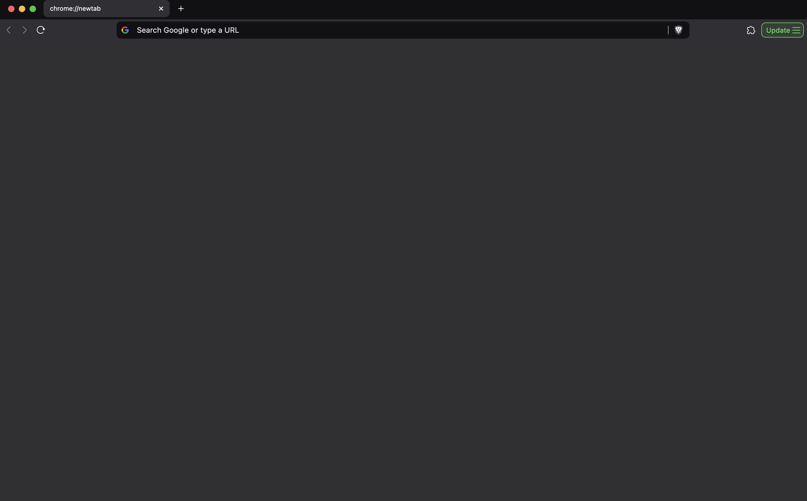

# New Tab

An ultra-minimalist extension for changing Brave's solid color background when opening a new tab.

Brave Browser allows a limited set of default colors for the background. If you try to add a custom image, it adds an annoying vignette. This allows you to set any custom solid color without any pop-ups or vignette.

### Installation

1. Download this repository (Code -> Download Zip -> Extract Zip)
2. Open Brave and go to ```brave://extensions```.
3. Enable Developer Mode (toggle in the top-right corner).
4. Click Load Unpacked and select this project folder.

### Changing background color

Inside ```newtab.html``` change the background color to the hexidecimal you want through the ```background: ``` option

### Example

Here is what it looks like by default




### Code

The code is tiny, here are all the files:

manifest.json
```json
{
    "manifest_version": 3,
    "name": "Blank New Tab",
    "version": "1.0",
    "description": "Overrides the new tab page with a blank solid color.",
    "chrome_url_overrides": {
      "newtab": "newtab.html"
    },
    "permissions": ["chrome_url_overrides"]
  }
```

newtab.html
```html
<!DOCTYPE html>
<html>
  <head>
    <style>
      body {
        background: #303034; /* Change to any color (e.g., #000000) */
        margin: 0;
        padding: 0;
        height: 100vh;
      }
    </style>
  </head>
  <body></body>
</html>
```